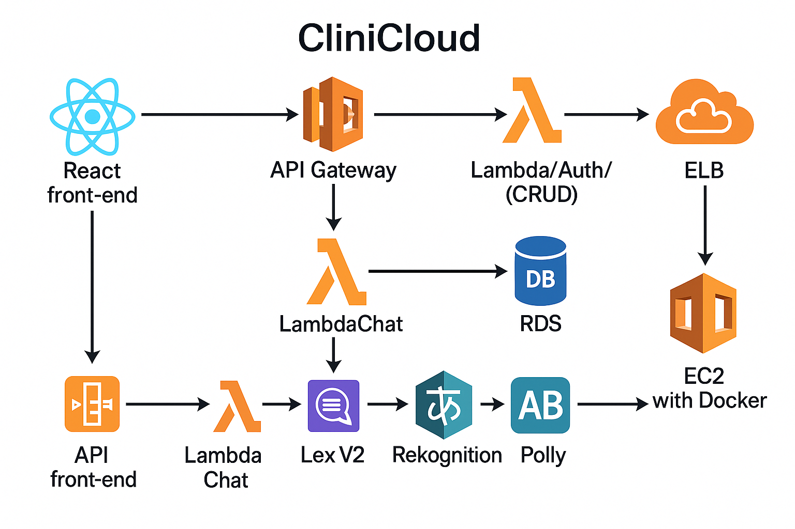

# 📘 Manual Técnico - Proyecto CliniCloud

## Índice

1. [Objetivos del Proyecto](#objetivos-del-proyecto)
2. [Arquitectura del Proyecto](#arquitectura-del-proyecto)

   * [Diagrama de Componentes](#diagrama-de-componentes)
   * [Flujo de Datos](#flujo-de-datos)
3. [Presupuesto Estimado](#presupuesto-estimado)
4. [Investigación de Servicios AWS](#investigación-de-servicios-aws)

   * [Servicios Obligatorios](#servicios-obligatorios)
   * [Servicios Básicos](#servicios-básicos)
   * [Servicios Avanzados](#servicios-avanzados)
   * [Servicio Extra Propuesto](#servicio-extra-propuesto)

---

## 🎯 Objetivos del Proyecto

* **Innovación**: Crear una plataforma en la nube que transforme la gestión clínica tradicional, ofreciendo agendamiento, resultados y comunicación en tiempo real.
* **Seguridad y Privacidad**: Proteger datos sensibles con AWS Cognito y cifrado en tránsito y reposo.
* **Escalabilidad**: Diseñar una arquitectura serverless y contenedorizada capaz de escalar bajo demanda.
* **Experiencia de Usuario**: Desarrollar interfaces limpias con React + TailwindCSS y un chatbot accesible.
* **Mantenimiento y Extensibilidad**: Documentación completa y uso de infraestructuras declarativas (IaC) para facilitar futuros cambios.

---

## 🏗️ Arquitectura del Proyecto

### Diagrama de Componentes

### Flujo de Datos

1. **Autenticación**: El usuario inicia sesión en React; las credenciales se envían a Cognito vía API Gateway/Lambda.
2. **Agendar Citas & CRUD**: Frontend consume endpoints de API Gateway que invocan Lambdas conectadas a RDS y S3.
3. **Chatbot**: React → API Gateway (/chat) → LambdaChat → Lex V2 → (opcional fulfillment) → LambdaAuth consulta RDS → respuesta → React.
4. **Servicios Multimedia**: Subida de documentos/facturas a S3; reconocimiento con Rekognition.
5. **Traducción y Voz**: AWS Translate para soporte multilenguaje; Polly para generar audio.

---

## 🤖 Integración del Chatbot

Para mejorar la interacción, implementamos un chatbot con AWS Lex V2 y Lambdas:

1. **React Frontend** envía mensaje a `/chat` en API Gateway.
2. **LambdaChat** recibe el request y pasa el texto a **Lex V2**.
3. **Lex** analiza la intención; si es consulta de cita o resultado, invoca fulfillment.
4. **Fulfillment (LambdaAuth)** consulta **RDS** y genera respuesta.
5. **LambdaChat** devuelve la respuesta a React, que la muestra al usuario.

Con esta arquitectura garantizamos un asistente conversacional **escalable**, **multilenguaje**, y **personalizable**.

---

## 💸 Presupuesto Estimado

| Servicio             | Configuración                      | Coste Mensual Aproximado (USD) |
| -------------------- | ---------------------------------- | -----------------------------: |
| AWS Cognito          | 1,000 MAUs                         |                           \$10 |
| API Gateway          | 1M solicitudes                     |                           \$30 |
| AWS Lambda           | 3M invocaciones (128 MB, 1 s)      |                            \$6 |
| RDS MySQL            | db.t3.small, 20 GB almacenamiento  |                           \$50 |
| S3                   | 50 GB almacenamiento, 100K PUT/GET |                            \$5 |
| EC2 + Docker         | t3.micro (solo entorno dev)        |                            \$8 |
| ELB                  | 100K solicitudes                   |                           \$10 |
| Rekognition          | 10K imágenes analizadas            |                           \$12 |
| Translate            | 1M caracteres traducidos           |                           \$15 |
| Lex V2               | 10K solicitudes                    |                           \$25 |
| Polly                | 1M caracteres sintetizados         |                            \$4 |
| **Total Aproximado** |                                    |                      **\$175** |

> 🔍 *Estos valores son estimaciones y pueden variar según región y uso real.*

---

## 🔍 Investigación de Servicios AWS

En esta sección profundizamos en cada servicio de AWS seleccionado, explorando sus características, casos de uso, ventajas, costos y recomendaciones para CliniCloud.

### 🛠️ Servicios Obligatorios

1. **Amazon Cognito**

   * **Función**: Gestión de identidades y autenticación de usuarios.
   * **Casos de Uso**: Registro, inicio de sesión, recuperación de contraseña y federación con redes sociales.
   * **Ventajas**: Integración nativa con API Gateway y Lambda; soporte de MFA y políticas de contraseñas; escalabilidad automática.
   * **Costos**: Primeras 50,000 MAU gratuitas; luego tarifa por usuario activo.
   * **Configuración Recomendable**: Habilitar verificación de correo, MFA opcional, y grupos (Doctor, Laboratorio) con roles IAM.

2. **AWS Lambda**

   * **Función**: Ejecución de funciones serverless para lógica de negocio (CRUD, login, chat).
   * **Casos de Uso**: Endpoints de API, procesamiento de imágenes en S3, fulfillment del chatbot.
   * **Ventajas**: Escalado instantáneo, pago por solicitud y tiempo de ejecución, sin gestión de servidores.
   * **Costos**: Primeros 1M invocaciones gratuitas; luego tarifas por invocación y duración.
   * **Recomendaciones**: Mantener el paquete de funciones <50 MB; usar versiones/alias para despliegue continuo.

3. **Amazon API Gateway**

   * **Función**: Exposición de APIs RESTful y HTTP para el frontend y chatbot.
   * **Casos de Uso**: Punto de entrada unificado para todas las Lambdas.
   * **Ventajas**: Autorización integrada con Cognito; transformación de payloads; caching y throttling.
   * **Costos**: Primeros 1M llamadas gratuitas (solo HTTP API); luego tarifas por millón de llamadas y transferencia de datos.
   * **Configuración Recomendable**: Usar HTTP APIs para menor costo, habilitar CORS y stage variables.

4. **Docker**

   * **Función**: Contenerización de microservicios para despliegues en EC2 o ECS.
   * **Casos de Uso**: Entornos de desarrollo replicables, batch jobs o servicios complementarios.
   * **Ventajas**: Consistencia entre local y nube; fácil versión de dependencias.
   * **Costos**: Dependen de la infraestructura de ejecución (EC2/ECS).
   * **Recomendación**: Definir imágenes ligeras (<200 MB) y usar multi-stage builds.

---

### 🏗️ Servicios Básicos

1. **Amazon EC2**

   * Instancias t3.micro para entornos de desarrollo, con opción a t3.small en producción ligera.
2. **Elastic Load Balancer (ALB)**

   * Distribución de tráfico HTTP/HTTPS hacia instancias o contenedores.
3. **Amazon RDS (MySQL)**

   * Base de datos relacional para pacientes, pruebas y recetas con backups automatizados.
4. **Amazon S3**

   * Almacenamiento de archivos (facturas digitales, logs, exportaciones), con versioning y ciclo de vida.

---

### 🚀 Servicios Avanzados

1. **Amazon Rekognition**

   * **Función**: Análisis de imágenes y reconocimiento facial.
   * **Uso**: Validar acceso al módulo de despensa médico y extraer datos de facturas.
   * **Costos**: Pago por cada 1000 imágenes procesadas.

2. **Amazon Translate**

   * **Función**: Traducción automática de texto.
   * **Uso**: Soporte multilenguaje en formularios, chatbot y notificaciones.

3. **Amazon Lex V2**

   * **Función**: Chatbot conversacional con NLP.
   * **Uso**: Procesar intenciones (agendar, consultar resultados, soporte) y dirigir al fulfillment.

4. **Amazon Polly**

   * **Función**: Generación de voz a partir de texto.
   * **Uso**: Opcional para accesibilidad: leer resultados al paciente.

---

### 🌟 Servicio Extra Propuesto: Amazon SNS

* **Función**: Sistema de notificaciones push, correo y SMS.
* **Uso**: Recordatorios de cita, alertas de resultados listos, mensajes de urgencia.
* **Ventajas**: Alta entrega, integración con Lambda y SQS, plantillas personalizables.

---

© 2025 CliniCloud • USAC • Grupo 14 • Ingeniería de Sistemas
