# Manual de Usuario - CliniCloud

> 🚀 **¡Bienvenido a CliniCloud!** Tu salud en la nube, sencilla y segura.

---

## 📑 Tabla de Contenidos

1. [🎯 Objetivos del Manual](#-objetivos-del-manual)
2. [📝 Descripción de la Aplicación](#-descripción-de-la-aplicación)
3. [🧭 Guía de Uso](#-guía-de-uso)

   * [🏠 Pantalla de Inicio](#-pantalla-de-inicio)
   * [📝 Registro de Cita](#-registro-de-cita)
   * [💬 Chatbot de Ayuda](#-chatbot-de-ayuda)
   * [🔐 Inicio de Sesión](#-inicio-de-sesión)
   * [👨‍⚕️ Dashboard de Doctor](#-dashboard-de-doctor)

     * [📅 Mis Citas](#-mis-citas)
     * [📄 Resultados y Recetas](#-resultados-y-recetas)
     * [💊 Despensa de Medicinas](#-despensa-de-medicinas)
   * [🏭 Dashboard de Laboratorio](#-dashboard-de-laboratorio)

     * [🔍 Revisar Solicitudes](#-revisar-solicitudes)
     * [📤 Enviar Informes](#-enviar-informes)
     * [📤 Pruebas Realizadas](#-pruebas-realizadas)
4. [📞 Contacto y Soporte](#-contacto-y-soporte)

---

## 🎯 Objetivos del Manual

* ✅ **Facilitar** el uso de CliniCloud con instrucciones claras.
* ✅ **Guiar** paso a paso cada funcionalidad para pacientes, médicos y laboratorios.
* ✅ **Mejorar** la experiencia con consejos.

---

## 📝 Descripción de la Aplicación

CliniCloud es una plataforma **integral** que conecta pacientes, médicos y laboratorios:

* 🧑‍⚕️ **Pacientes** agendan citas y consultan resultados.
* 👨‍⚕️ **Doctores** gestionan citas, recetan y mantienen su inventario.
* 🧪 **Laboratorios** reciben solicitudes, procesan pruebas y envían informes.
* 💬 **Chatbot** integrado para resolver dudas en tiempo real.

Todas las acciones se realizan de forma **segura** y **privada** usando los servicios de AWS.

---

## 🧭 Guía de Uso

### 🏠 Pantalla de Inicio

1. Ingresa a la URL principal de CliniCloud.
2. Disfruta del eslogan **“Tu salud, en la nube”**.
3. Haz clic en **Agendar Cita** o usa el menú superior.

> 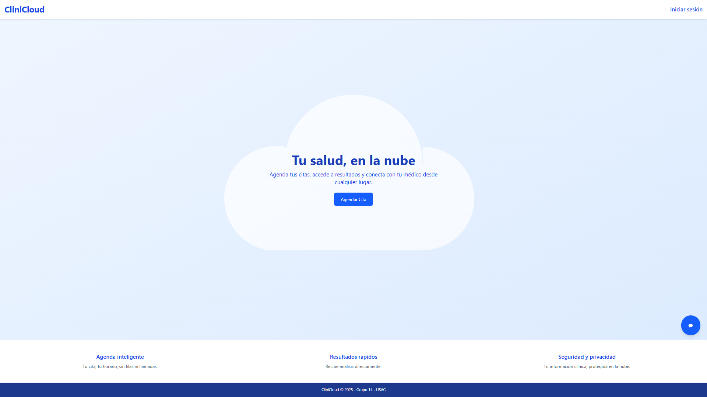
> *Figura 1: Pantalla de inicio*

---

### 📝 Registro de Cita

1. Completa tu **Nombre**, **Correo** y **Motivo**.
2. Selecciona **Fecha** y **Hora** de la cita.
3. Presiona **Agendar cita**.
4. Copia tu **Código único** para futuras consultas.

> ℹ️ *Guarda el código: será necesario para ver resultados.*

> 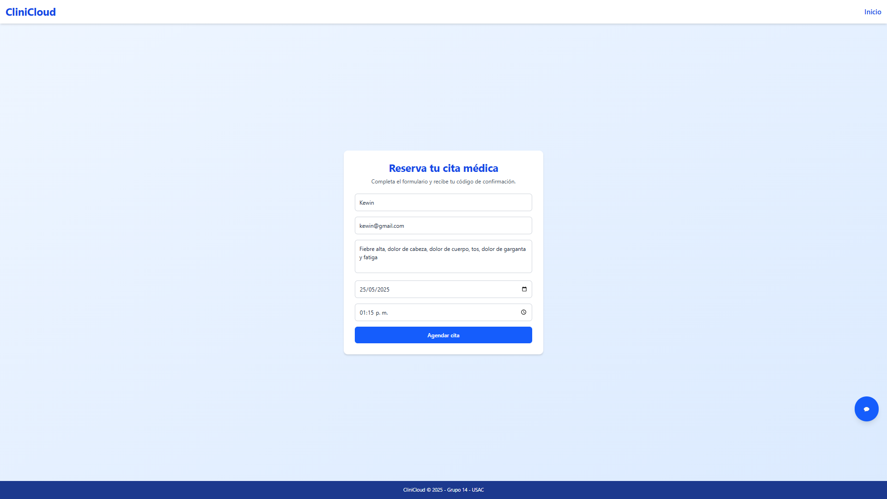
> *Figura 2: Formulario de agendamiento*

 

> 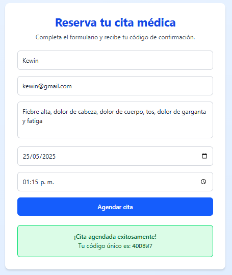 
> *Figura 3: Cita agendada*
---

### 💬 Chatbot de Ayuda

* Ubicado en la esquina inferior derecha.
* Haz clic en el icono para **abrir la ventana** de chat.
* Escribe tus preguntas (en español o inglés) y recibe respuestas inmediatas.

> 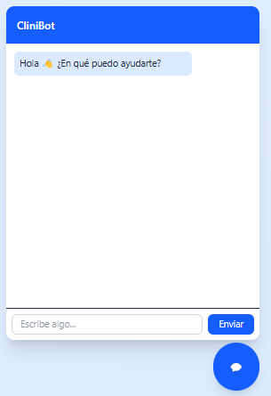 
> *Figura 4: Chatbot activo*

---

### 🔐 Inicio de Sesión

1. Haz clic en **Iniciar sesión** en el navbar.
2. Ingresa **Correo** y **Contraseña**.
3. Selecciona tu rol automáticamente (Doctor o Laboratorio).
4. Serás redirigido a tu **Dashboard**.

> 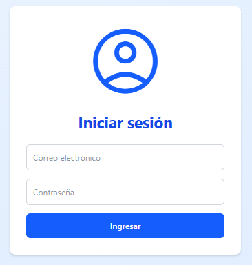 
> *Figura 5: Pantalla de login*

---

### 👨‍⚕️ Dashboard de Doctor

#### 📅 Calendario

* Visualiza tu calendario con **vistas**: mes, semana o día.
* Usa las **flechas** o botones para navegar.
* Haz clic en una cita para ver detalles.

> 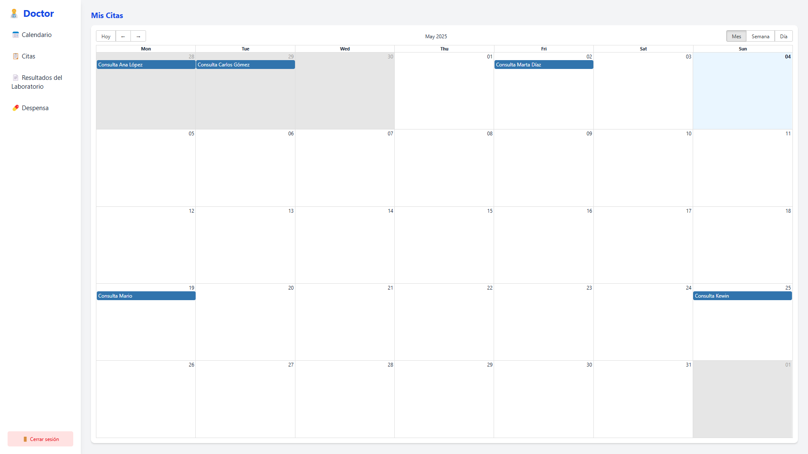
> *Figura 6: Calendario de citas*

#### 📄 Citas

1. Navega a **Citas**.
2. Revisa los detalles de los pacientes.
3. Haz clic en **enviar al laboratorio** para su análisis.

> 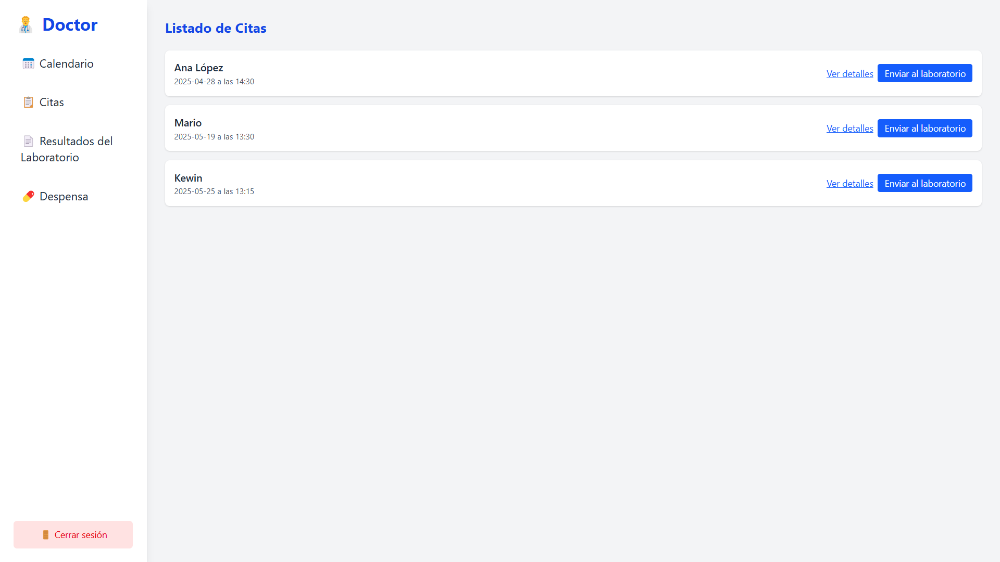 
> *Figura 7: Listado de pacientes*

 

> 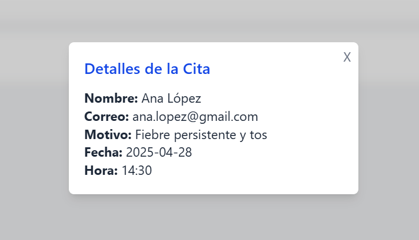 
> *Figura 8: Detalles de los pacientes*

#### 📄 Resultados del laboratorio

1. Navega a **Resultados**.
2. Revisa diagnósticos pendientes.
3. Haz clic en **Asignar receta** para un paciente.
4. Selecciona **medicinas** y **cantidades**, confirma.
5. Finalmente, pulsa **Terminar cita** para enviar el resultado.

> 💡 *La receta se descontará automáticamente de tu despensa.*

> 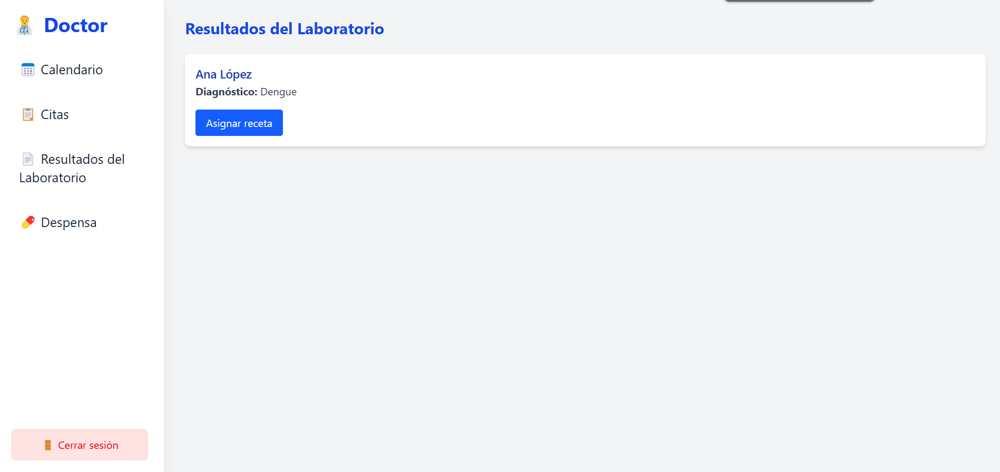
> *Figura 9: Resultados del laboratorio*

 

> 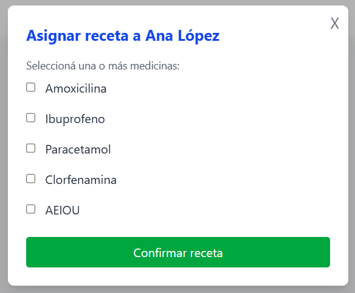 
> *Figura 10: Asignación de receta*

#### 💊 Despensa de Medicinas

* Consulta tu inventario de medicinas.
* Edita cantidades o **agrega nuevas**.
* Autenticación opcional vía **reconocimiento facial**.

> 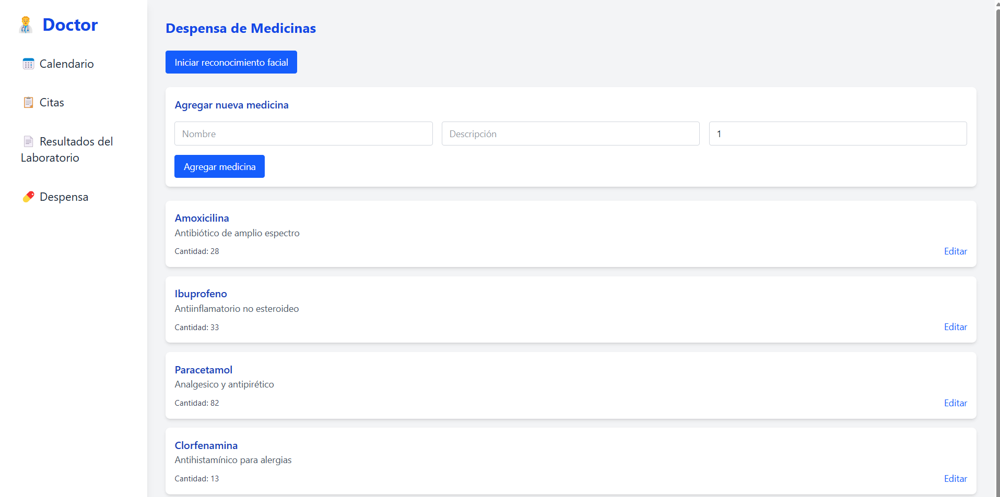
> *Figura 11: Gestión de despensa*

---

### 🏭 Dashboard de Laboratorio

#### 🔍 Revisar Solicitudes

1. Entra a **Solicitudes Pendientes**.
2. Haz clic en **Atender** junto a cada paciente.
3. Escribe el **diagnóstico** y pulsa **Terminar informe**.

> 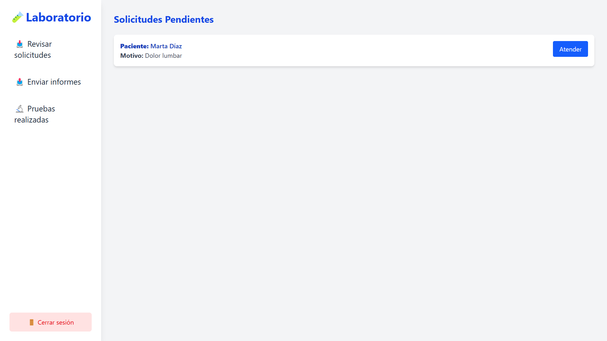
> *Figura 12: Solicitudes de laboratorio*

#### 📤 Enviar Informes

* Accede a **Pruebas Realizadas** para ver informes enviados.
* Cada tarjeta muestra **Paciente**, **Motivo** y **Diagnóstico**.

> 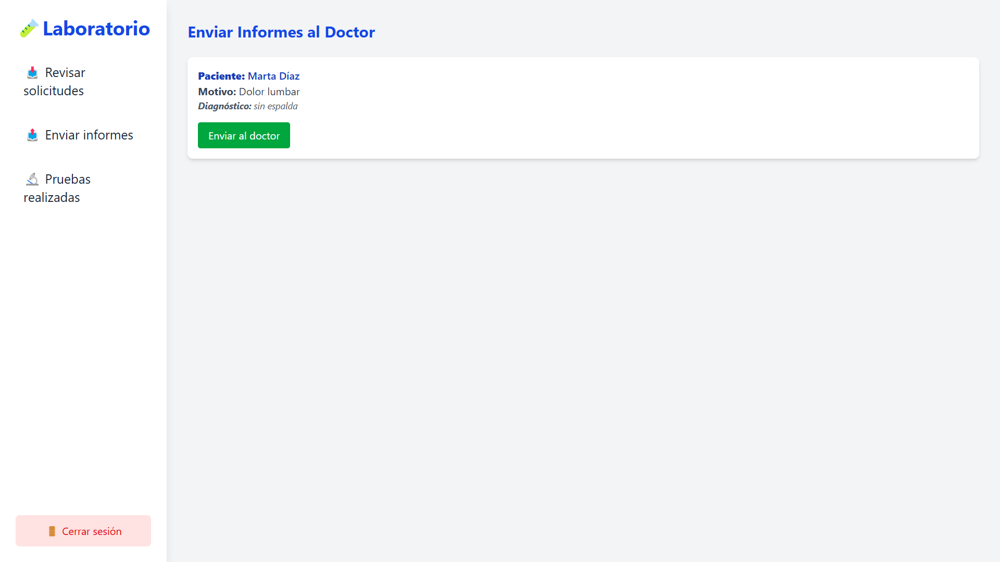
> *Figura 13: Enviar al doctor*

#### 📤 Pruebas Realizadas

* Accede a **Pruebas Realizadas** para ver informes enviados.
* Cada tarjeta muestra **Paciente**, **Motivo** y **Diagnóstico**.

> 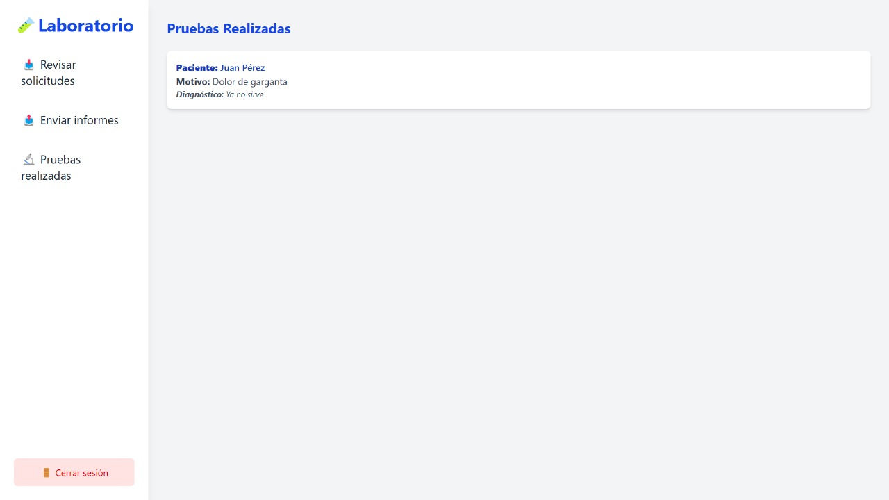 
> *Figura 14: Informe enviado*

---

## 📞 Contacto y Soporte

> **¿Tienes dudas o necesitas ayuda?**

* 📧 correo: **[soporte@clinicloud.com](2815806340401@ingenieria.usac.edu.gt)**

*Siempre listos para asistirte.*

---

© 2025 CliniCloud • USAC • Grupo 14 • ¡Tu salud, nuestra misión!
